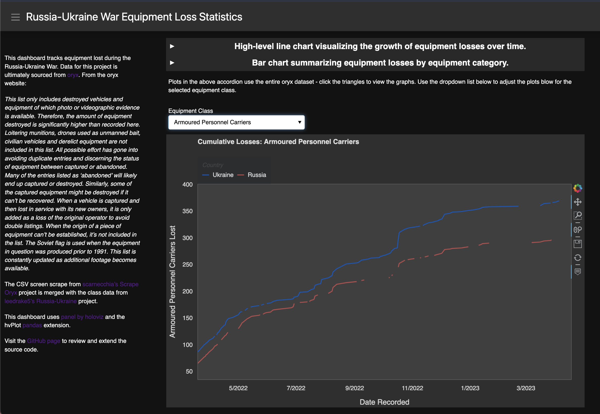

# RussiaUkraineWarEquipmentLosses

This dashboard tracks equipment lost during the Russia-Ukraine War. 
Data for this project is ultimately sourced from [oryx](https://www.oryxspioenkop.com/2022/02/attack-on-europe-documenting-equipment.html).
From the oryx website:

*This list only includes destroyed vehicles and equipment of which photo or videographic evidence is available. Therefore, the amount of equipment destroyed is significantly higher than recorded here. Loitering munitions, drones used as unmanned bait, civilian vehicles and derelict equipment are not included in this list. All possible effort has gone into avoiding duplicate entries and discerning the status of equipment between captured or abandoned. Many of the entries listed as ‘abandoned’ will likely end up captured or destroyed. Similarly, some of the captured equipment might be destroyed if it can’t be recovered. When a vehicle is captured and then lost in service with its new owners, it is only added as a loss of the original operator to avoid double listings. When the origin of a piece of equipment can’t be established, it’s not included in the list. The Soviet flag is used when the equipment in question was produced prior to 1991. This list is constantly updated as additional footage becomes available.*

The screen scrape from [scarnecchia's](https://github.com/scarnecchia) [Scrape Oryx](https://github.com/scarnecchia/scrape_oryx) project 
is merged with the class data from
[leedrake5's](https://github.com/leedrake5) [Russia-Ukraine](https://github.com/leedrake5/Russia-Ukraine) project.  

This dashboard uses [panel by holoviz](https://panel.holoviz.org/) and the [hvPlot](https://hvplot.holoviz.org/) [pandas](https://pandas.pydata.org/) extension.

To start the dashboard, execute this command from your terminal:
panel serve --show --autoreload RussiaUkraineWar.ipynb 
